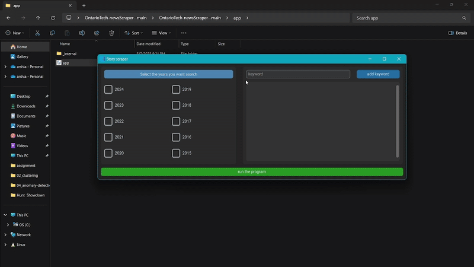

# Story Extractor
This a scraper app with a dyanamic GUI for extracting stories from Ontario Tech's news page based on keywords into an easily accesible CSV file. The UI is created used Tkinter and the data scraping is 
hanlded using beautifulsoup4. This app is designed to be used by the memebers of the advancement team at Ontario Tech but a desicion has been made to make it publicily available. 

## Features

- Filter stories by year.
- Keyword-based search for titles and descriptions.
- Results saved in an Excel sheet for easy access and further analysis.

## Getting Started

### Prerequisites

Ensure you have the **Story Extractor** folder downloaded on your device, which includes the `app.exe` file.

### Installation

No installation is required. Just navigate to the folder containing `app.exe`.

### Usage

1. **Open the Story Extractor Folder**  
   Locate and open the **Story Extractor** folder on your device.

2. **Launch the Application**  
   Double-click `app.exe` to start the application.

3. **Set Search Criteria**  
   - On the left, select the years you want the program to search.
   - Enter keywords to filter stories based on titles or descriptions.

4. **Add or Remove Keywords**  
   - Enter a keyword in the text box and click **Add Keyword**.
   - To remove a keyword, use the **Remove** button beside it in the keyword box.
   - Ensure correct spelling for accurate results.

5. **Run the Program**  
   Click **Run the Program** to begin the search.

6. **Completion Notification**  
   A pop-up message will notify you when the search is complete, and the Excel sheet is ready.

7. **Locate the Excel Sheet**  
   The Excel sheet will be saved in the same folder as `app.exe`.  
   - **Note:** If the sheet is not found, there were no stories matching your keywords.

## Troubleshooting

- Double-check the keywords for spelling accuracy.
- Ensure the selected years are available on the website for optimal results.
